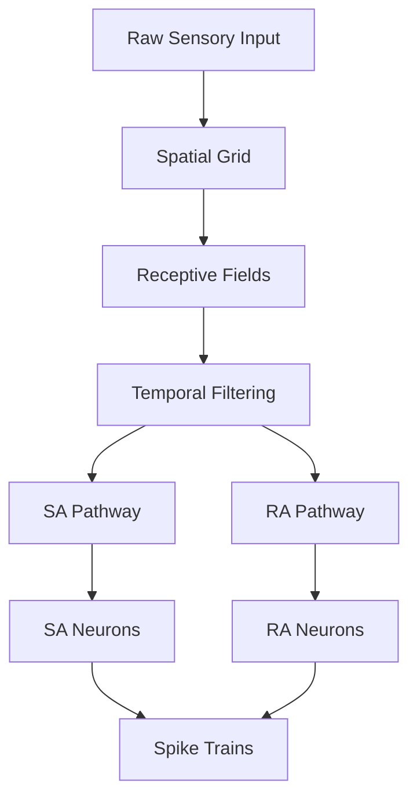

# Core Concepts

Understanding SensoryForge's architecture and design philosophy.

## Design Philosophy

SensoryForge is built around three core principles:

1. **Modality-Agnostic Architecture** — Same framework for touch, vision, audition, and custom modalities
2. **Biologically Grounded** — Components map to neuroscience concepts (receptive fields, adaptation, spike generation)
3. **Production-Ready** — GPU-accelerated, differentiable, and suitable for ML training

## Architecture Overview



### Data Flow

1. **Stimulus** → High-dimensional sensory input (e.g., pressure map, image)
2. **Grid** → Spatial substrate of receptor positions
3. **Innervation** → Receptive fields connecting receptors to neurons
4. **Filtering** → Temporal dynamics (sustained vs. transient pathways)
5. **Spiking** → ODE-based neuron models generate spike trains
6. **Output** → Sparse, event-based neural representation

## Key Components

### 1. Spatial Grid

**Purpose:** Define the spatial arrangement of sensory receptors.

**Types:**
- **Standard Grid** — Regular 2D array
- **Composite Grid** — Multi-population mosaic (e.g., SA1/RA1/SA2 in touch, L/M/S cones in vision)
- **Custom Arrangements** — Hexagonal, Poisson, jittered

**Example:**
```python
# Standard grid
config = {
    'pipeline': {
        'grid_size': 80,      # 80×80 grid
        'spacing': 0.15,      # 0.15mm spacing
    }
}

# Composite grid (multi-population)
config = {
    'grid': {
        'type': 'composite',
        'populations': {
            'SA1': {'density': 100, 'arrangement': 'hex'},
            'RA1': {'density': 70, 'arrangement': 'poisson'},
        }
    }
}
```

### 2. Innervation (Receptive Fields)

**Purpose:** Define how receptors connect to downstream neurons.

**Key Concepts:**
- **Convergence:** Multiple receptors → single neuron
- **Overlap:** Receptive fields can overlap spatially
- **Weighting:** Gaussian, distance-weighted, or custom

**Types:**
- **Gaussian Innervation** — Smooth Gaussian weighting
- **Distance-Weighted** — Inverse distance falloff
- **Flat Innervation** — For irregular (non-grid) receptor layouts

**Example:**
```yaml
innervation:
  receptors_per_neuron: 28
  sa_spread: 0.3   # Receptive field size (mm)
  ra_spread: 0.39
```

### 3. Temporal Filters

**Purpose:** Model temporal dynamics of sensory pathways.

**Dual-Pathway Processing:**
- **SA (Slowly Adapting)** — Sustained response to static stimuli
- **RA (Rapidly Adapting)** — Transient response to changes

**Biological Analogy (Touch):**
- SA: Pressure magnitude (Merkel discs, Ruffini endings)
- RA: Velocity/vibration (Meissner corpuscles, Pacinian corpuscles)

**Example:**
```yaml
filters:
  sa_tau_r: 5.0    # Rise time constant (ms)
  sa_tau_d: 30.0   # Decay time constant (ms)
  ra_tau_ra: 15.0  # RA time constant (ms)
```

### 4. Neuron Models

**Purpose:** Convert filtered currents into spike trains.

**Available Models:**
- **Izhikevich** — Efficient, captures diverse spike patterns
- **AdEx** — Adaptive exponential integrate-and-fire
- **MQIF** — Multi-quadratic integrate-and-fire
- **Custom (DSL)** — Define via equations

**Example:**
```python
# Hand-written model
from sensoryforge.neurons.izhikevich import IzhikevichNeuronTorch

# Equation DSL model
from sensoryforge.neurons.model_dsl import NeuronModel

model = NeuronModel(
    equations='''
        dv/dt = (0.04*v**2 + 5*v + 140 - u + I) / ms
        du/dt = (a * (b*v - u)) / ms
    ''',
    threshold='v >= 30',
    reset='v = c; u = u + d',
    parameters={'a': 0.02, 'b': 0.2, 'c': -65.0, 'd': 8.0}
)
```

### 5. Stimuli

**Purpose:** Generate sensory input patterns.

**Categories:**
- **Static:** Gaussian blobs, textures
- **Moving:** Linear, circular motion
- **Temporal:** Step, ramp, trapezoidal profiles
- **Composite:** Multiple stimuli combined

**Example:**
```python
# Gaussian stimulus
results = pipeline.forward(
    stimulus_type='gaussian',
    amplitude=30.0,
    sigma=0.5,
    center_x=0.0,
    center_y=0.0
)

# Gabor texture
results = pipeline.forward(
    stimulus_type='gabor',
    frequency=1.0,
    orientation=45,
    amplitude=25.0
)
```

### 6. ODE Solvers

**Purpose:** Integrate neuron model differential equations.

**Available Solvers:**
- **Euler** — Fast, sufficient for most cases (default)
- **Adaptive (Dormand-Prince)** — High accuracy for stiff systems

**Example:**
```yaml
solver:
  type: euler  # or 'adaptive'
  config:
    dt: 0.001  # 1ms time step
```

## Coordinate Systems

### Spatial Coordinates

- **Origin:** Grid center at (0, 0)
- **Units:** Millimeters (mm)
- **Axes:** X (horizontal), Y (vertical)

### Temporal Coordinates

- **Units:** Milliseconds (ms) for user APIs
- **Internal:** Seconds (s) for ODE integration
- **Time Step:** Configurable (default: 0.5ms for spikes, 0.001s for ODE)

## Tensor Shapes

Understanding tensor dimensions is crucial:

### Stimulus Tensor
```
[batch, time, height, width] or [batch, height, width]
```

### Receptive Field Weights
```
[num_neurons, num_receptors]
```

### Filtered Currents
```
[batch, time, num_neurons]
```

### Spike Trains
```
[time_steps, num_neurons]  # Binary (0 or 1)
```

## Pipeline Modes

### 1. Interactive (GUI)

- Real-time visualization
- Parameter tuning
- Exploratory analysis

### 2. Scripted (Python API)

- Reproducible pipelines
- Custom analysis
- Integration with ML workflows

### 3. Batch (CLI + YAML)

- Large-scale simulations
- Parameter sweeps
- Dataset generation

## Reproducibility

SensoryForge ensures reproducibility through:

1. **Deterministic Seeding** — Fixed random seeds
2. **YAML Configs** — Declarative pipeline specification
3. **Checkpoint/Resume** — Batch execution can be resumed
4. **Metadata Tracking** — All runs record full configuration

**Example:**
```yaml
pipeline:
  seed: 42  # Reproducible random number generation
```

## Differentiability

All components are PyTorch `nn.Module` instances, enabling:

- **Gradient Computation** — Backprop through entire pipeline
- **ML Integration** — Train encoding parameters end-to-end
- **Adjoint Method** — Memory-efficient gradients through ODEs (via torchdiffeq)

## Extensibility Points

You can customize:

1. **Grid Layouts** — Custom spatial arrangements
2. **Innervation Patterns** — Custom receptive field generators
3. **Filters** — Custom temporal dynamics
4. **Neuron Models** — Via DSL or hand-written `nn.Module`
5. **Stimuli** — Custom stimulus generators
6. **Solvers** — Custom ODE integrators

## Units Reference

| Quantity | Units | Example |
|----------|-------|---------|
| Space | mm | `spacing: 0.15` |
| Time | ms | `t_plateau: 500` |
| Current | mA | Internal |
| Voltage | mV | `v_init: -65.0` |
| Angle | degrees | `orientation: 45` |
| Frequency | cycles/mm | `frequency: 1.0` |

## Next Steps

- [First Simulation](first_simulation.md) — Build your first pipeline
- [User Guide](../user_guide/overview.md) — Detailed component reference
- [Tutorials](../tutorials/quickstart_tutorial.md) — Hands-on examples
