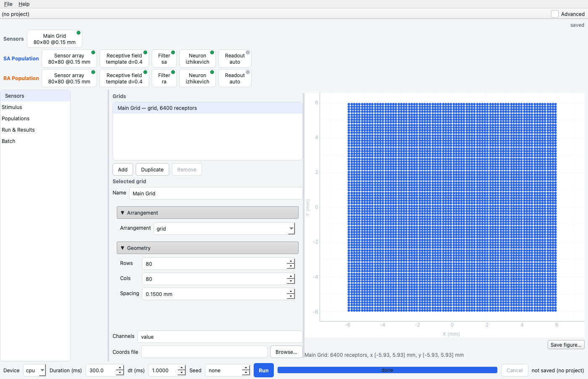
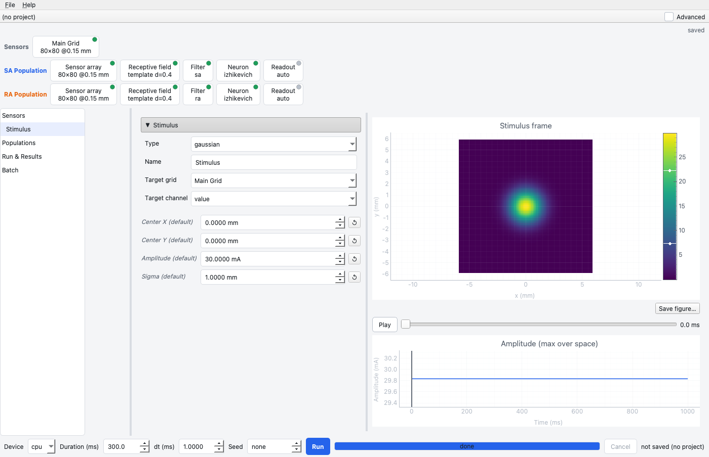
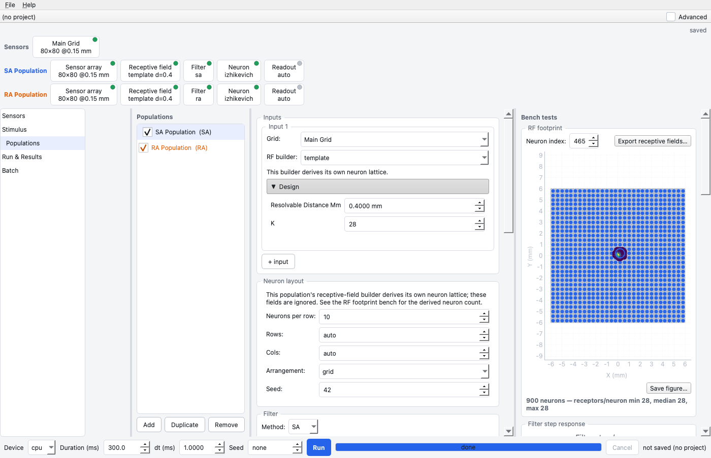
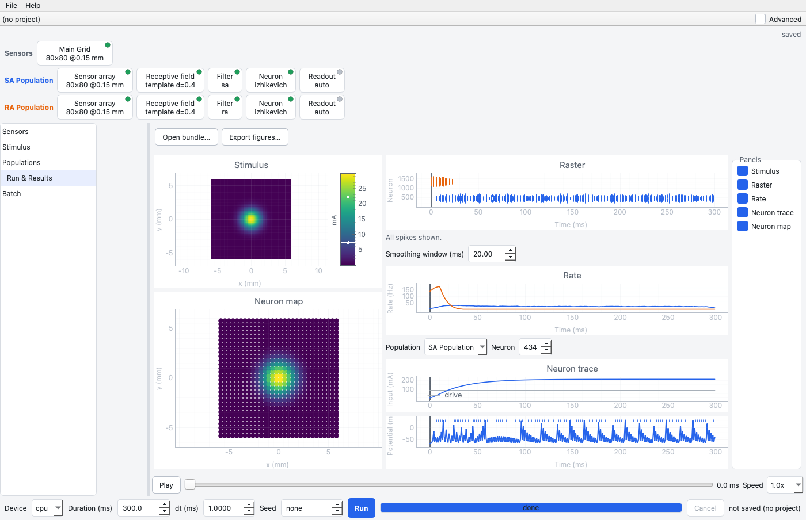
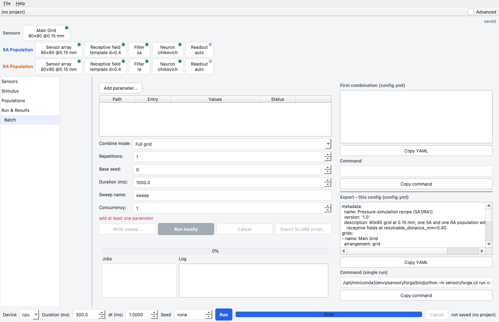

# SensoryForge GUI Walkthrough

This page walks through one experiment in the SensoryForge GUI: the
[pressure-simulation recipe](../concepts/pressure_simulation_use_case.md), an 80×80
receptor grid read by an SA and an RA population whose receptive fields come from the
`template` builder at a 0.40 mm resolvable distance. The screenshots are grabs of the
real window after a real 300 ms run (see [Regenerating the
screenshots](#regenerating-the-screenshots)).

## Launch

```bash
conda activate sensoryforge
python sensoryforge/gui/main.py
```

The window opens on the last project you used, or on the `tactile_sa1_ra1` preset.

## How the window is laid out

- **Stage list** (left): *Sensors · Stimulus · Populations · Run & Results · Batch*.
  Each stage is one screen, and every screen edits the same experiment.
- **Pipeline strip** (top): one row for the sensor arrays and one row per population,
  with a chip per stage — sensor array, receptive field, filter, neuron, readout
  (and *combine* when a population has several inputs). Each chip shows its key
  value, for example `template d=0.4` or `80×80 @0.15 mm`. Its dot is grey when the
  stage is at its default, green when set, and red when that stage would stop the
  engine building the experiment; hover a red dot to read why. Click a chip to jump
  to its editor. The right end says whether the experiment was edited since the last
  run.
- **Run bar** (bottom): device, duration, time step, seed, **Run**, progress,
  **Cancel**. The duration, step and seed are saved in the experiment's YAML. When
  the experiment would not build, Run is disabled and the bar says why.
- **Advanced** (top right): shows the parameters marked advanced in every form.

The experiment is one `SensoryForgeConfig`. **File > Save config** writes it as the
same YAML `sensoryforge run` reads, and **File > Open config** reads any canonical
YAML. A **project** (File > New project) is a folder holding `config.yml` and a
`runs/` folder; every run made with a project open is written there as a
[bundle](bundles.md).

## Sensors



The list holds the experiment's sensor arrays (grids); **Add**, **Duplicate** and
**Remove** manage it. A grid still read by a population cannot be removed, and a
renamed grid is renamed everywhere it is used. The form sets the arrangement (`grid`,
`hex`, `poisson`, `jittered_grid`, `blue_noise`), rows and columns, spacing, centre and
seed, the channel names (for a multi-channel array, see [sensor
arrays](../concepts/sensor_arrays.md)) and an optional coordinates file. The preview
is built with the engine's own grid code, so the receptor count and extent under it
are the ones a run uses. **Save figure…** writes the preview as PNG or SVG.

## Stimulus



Choose a stimulus type and set its parameters. A parameter you have not set shows,
in italics, the value that will run, and the ↺ button next to a set value returns it
to that default. The preview renders with the same function as the CLI and a run,
with a playhead and the amplitude over time. **Composite** and **timeline** stimuli
open a table of sub-stimuli: kind, amplitude, size and position, and for a timeline
when each is shown. A stimulus always runs on the run bar's time step.

## Populations



The list on the left holds the populations; tick a population off to leave it out
of runs. For the selected population the cards are:

- **Inputs** — the grid and channel it reads and the receptive-field builder, with
  that builder's own parameters. **+ input** adds a second input, which reveals the
  *combine* choice (`sum` needs equal neuron counts; `concat` does not).
- **Neuron layout** — the neuron lattice, for builders that do not derive their own.
- **Filter** — `SA`, `RA` or none, with its time constants and gains.
- **Neuron** — Izhikevich, AdEx, MQIF, FA, SA, or **DSL (Custom)**, which opens an
  equation editor. A DSL model with no threshold is an [analog
  readout](analog_readouts.md).
- **Readout & noise** — input gain (default 50, see [units and
  gains](units_and_gains.md)), noise, and the readout.

Every value a form shows is the value a run uses, including the defaults resolved for
the population's type (an RA population shows the fast-spiking Izhikevich preset).

The bench on the right tests the population without a full run: the **RF footprint**
of one neuron over the grid, the **filter step response**, the **neuron trace** and
f–I curve on a synthetic current, and **Quick run** (this population, 100 ms).
**Export receptive fields…** writes the population's receptive fields as a CSV
folder; choosing the `imported` builder with that folder as its path reads them back.

## Run & Results



Press **Run**. The run happens on a background thread, so the window stays usable
and **Cancel** stops it. The screen shows the stimulus and the neuron map on the left,
and the raster, population rates and one neuron's input current and membrane
potential on the right, all on one time cursor driven by **Play**. The panel list on
the right hides or shows panels. **Open bundle…** loads any bundle, from the GUI, the
CLI or a batch; **Export figures…** saves every visible panel as PNG and SVG.

The GUI's run is the engine's run: `tests/integration/test_gui_engine_equality.py`
checks that a GUI run, a direct `SimulationEngine.run()` and `sensoryforge run` on the
exported YAML give identical results.

## Batch



**Add parameter…** picks any field of the experiment; give it a list (`10, 20, 40`) or
a range. Several fields combine as a full grid or zipped, optionally repeated with
different seeds. The screen shows the job count and the first job's YAML and command.
**Run locally** runs the sweep as separate `sensoryforge` processes (a crash cannot
take the GUI down) with a status per job; **Export SLURM script…** writes an array job
for a cluster. The right-hand pane also shows the current experiment's YAML and the
exact `sensoryforge run` command for it.

## From the GUI to the CLI

**File > Export > YAML…** (or Save config) writes the experiment; the CLI runs it
unchanged:

```bash
sensoryforge run my_experiment.yml --bundle out/cli_bundle
```

Without `--duration`, the CLI runs the duration saved in the YAML (the run bar's).

## Regenerating the screenshots

```bash
QT_QPA_PLATFORM=offscreen python docs/scripts/generate_gui_screenshots.py
```

The script loads the preset, runs it for 300 ms and grabs the window on each screen
into `docs/assets/gui/`. Rerun it after any layout change.
