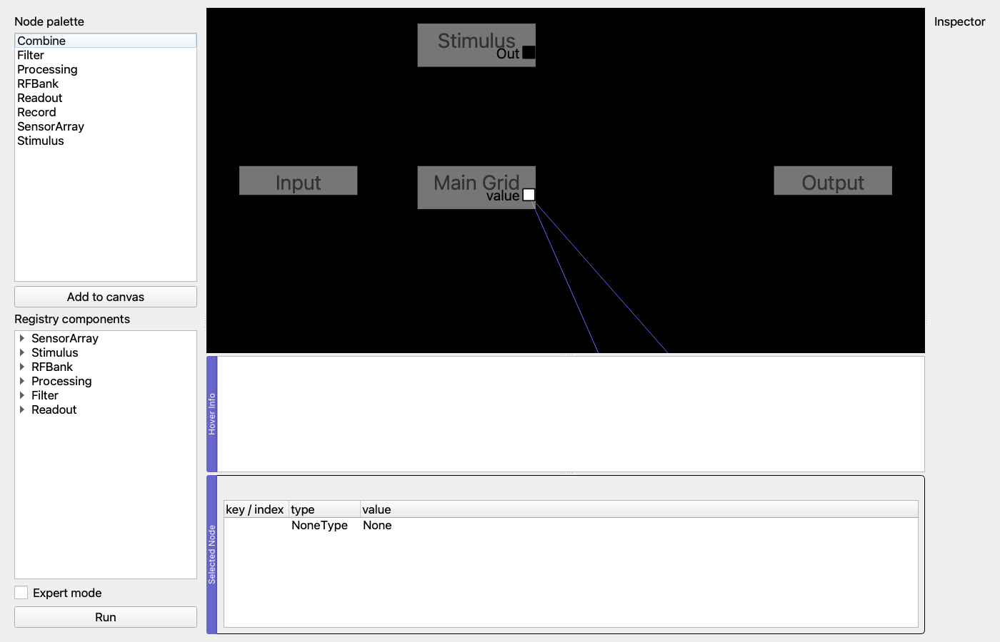
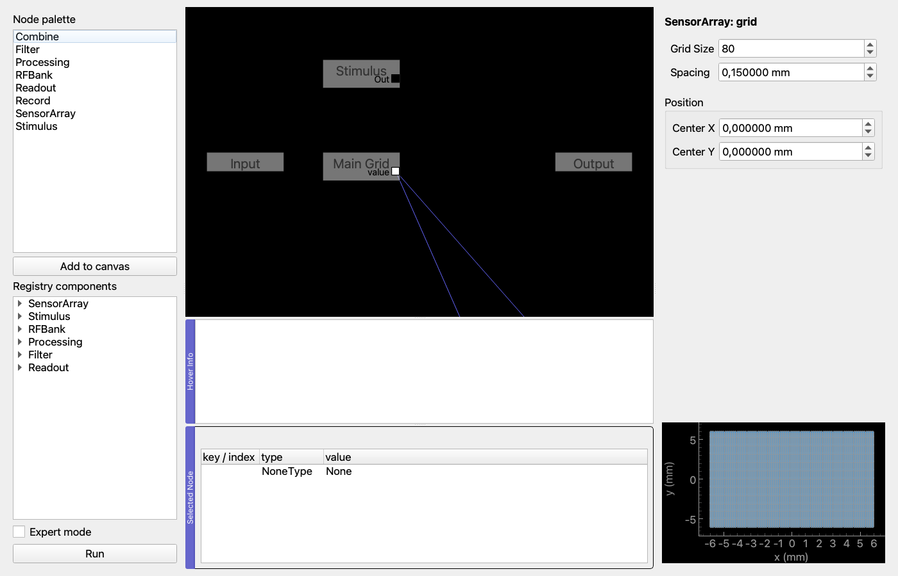
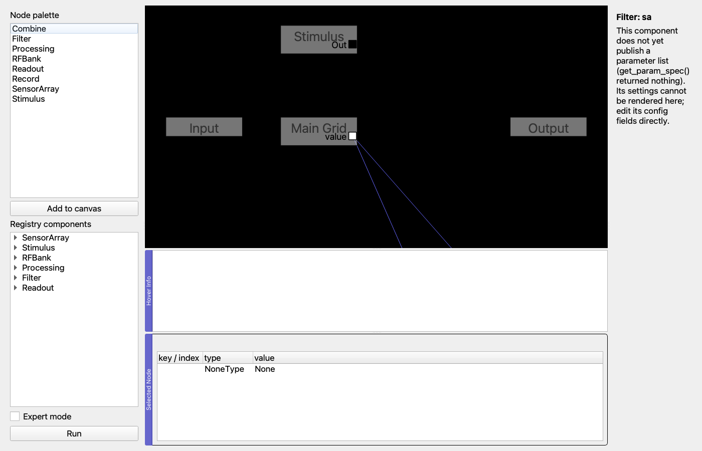

# SensoryForge GUI Walkthrough

This guide walks through a complete experiment using the SensoryForge GUI, built as a
node graph on the **Circuit tab** (Phase 3). It reproduces the
[pressure-simulation recipe](../concepts/pressure_simulation_use_case.md) — an 80x80
receptor grid, SA and RA populations with `template`-derived receptive fields at a
0.40 mm resolvable distance — as a graph, runs it, inspects a node, and exports the
result as a bundle the CLI can also produce.

Every step below was actually run while writing this page (the commands and output
are pasted verbatim from that run, offscreen, the same way the test suite runs the
GUI); where the graph did something other than what the Phase 3 spec implied, that is
called out rather than smoothed over.

## Launch

```bash
conda activate sensoryforge
python sensoryforge/gui/main.py
```

The window opens with six tabs. **Circuit is first** — it is the entry point to
building an experiment — followed by the five tabs Phase 2 shipped:

| Tab | Purpose |
|-----|---------|
| **Circuit** | Build the experiment as a node graph; run it |
| **Grid & Innervation** | The older, form-based way to configure a grid/population (still present; the graph is the new way) |
| **Stimulus Designer** | Design and preview a stimulus |
| **Spiking Neurons** | Choose a neuron model and run a single population outside the graph |
| **Visualization** | View spike rasters and drive signals — receives graph runs exactly as it receives Spiking-tab runs |
| **Batch** | Parameter sweeps, including sweeping a live graph (Wave Q) |

## Step 1 — Build the graph

The Circuit tab has three parts: a **node palette** on the left (structural node
types, plus a registry-driven tree of every registered grid arrangement, stimulus,
RF builder, filter and neuron model — Wave P, P3), the **canvas** in the middle, and
an **inspector** dock on the right that fills in once a node is selected.

A population is a connected chain: one or more `RFBank` nodes (optionally through a
`Processing` node) feed a `Filter` node, which feeds a `Readout` node. A
`SensorArray` node supplies the receptor channel(s); a `Stimulus` node supplies the
drive; a `Record` node is where a run's bundle is written. See the node-to-config
table in `sensoryforge/gui/circuit/nodes.py`'s module docstring — it is the one place
that mapping is written down, and this walkthrough follows it exactly.

Rather than placing ten nodes and wiring them by hand, the fastest way to reach the
pressure-simulation recipe is to load it — the graph equivalent of the CLI's
`sensoryforge run --preset tactile_sa1_ra1`:

```python
from sensoryforge.config.schema import SensoryForgeConfig
from sensoryforge.gui.circuit.serialise import config_to_graph

config = SensoryForgeConfig.from_yaml("sensoryforge/presets/tactile_sa1_ra1.yml")
config_to_graph(config, circuit_tab.flowchart)
```

`config_to_graph` lays the graph out deterministically: sensor arrays in a left
column, the stimulus above them, then one row per population reading left to right
(RF bank → filter → readout), with a `Record` node on the far right. Loading the same
config twice gives the same picture. This is what that looks like right after
loading:



Eleven nodes appear: `Main Grid` (SensorArray), `Stimulus`, one `RFBank`/`Filter` pair
per population (`SA Population__rf0`/`SA Population__filter`, same for RA),
`SA Population`/`RA Population` (Readout), `Record`, and pyqtgraph's own built-in
`Input`/`Output` I/O nodes (always present on a `Flowchart`, not part of the
config — `graph_to_config` ignores them). Six connections wire the two populations'
chains from the grid through to the record node.

To build the same graph by hand instead of loading a config, drag `SensorArray`,
`Stimulus`, `RFBank`, `Filter`, `Readout` and `Record` from the palette onto the
canvas, then connect a `SensorArray` output terminal to an `RFBank`'s `Channel`
input, the `RFBank`'s `Drive` to a `Filter`'s `Drive`, the `Filter`'s `Filtered` to a
`Readout`'s `Filtered`, and the `Readout`'s `Spikes` to the `Record` node's `In`. The
registry-driven part of the palette (the tree below the plain node-type list) places
a node and pre-selects one registered component in the same double-click — e.g.
double-clicking `template` under `RFBank` places an `RFBank` node with
`rf.method = "template"` already set.

## Step 2 — Inspect a node

Selecting a node fills the inspector dock with a form built from that node's
component's `get_param_spec()` (Wave P, P1) — a plugin component gets this for free,
with no GUI code (see [Extending: adding a Circuit node](../extending/add_gui_node.md)
for what `get_param_spec()` does *not* give a component for free). Selecting the
`Main Grid` node shows its grid parameters plus a receptor-position scatter (P2,
reusing `ReceptorGrid`, the same class the Mechanoreceptor tab's own grid view
builds from):



Selecting `SA Population__filter` shows the `sa` filter's parameters instead — no RF
or neuron controls, because a `Filter` node owns exactly
`PopulationConfig.filter_method`/`filter_params` and nothing else (the
`READOUT_FIELDS` tuple in `nodes.py` documents the split):



**Advanced parameters** (`ParamSpec.advanced=True`) are hidden until the **Expert
mode** checkbox above the Run button is ticked — the same `chk_expert_mode`
convention every other tab uses.

## Step 3 — Run and export

Click **Run**, or from a script:

```python
results = circuit_tab.run_graph(duration_ms=1100.0)
```

This builds a `SensoryForgeConfig` from the graph (`graph_to_config`), renders the
stimulus, runs it through `SimulationEngine`, and — because a `Record` node is on
the graph with an `output_dir` set — writes a bundle exactly as `sensoryforge run
--bundle` does, then emits the same `simulation_finished` signal the Spiking tab
emits. The Visualization tab receives it with no changes: switch to that tab to see
the spike rasters.

Running the graph above (20 ms, for a fast walkthrough run rather than the full
1100 ms recipe) produced 900 SA neurons and 900 RA neurons — matching the
`template` builder's derived count for `resolvable_distance_mm=0.40` on this grid
(`docs/concepts/pressure_simulation_use_case.md`) — and a bundle directory that
`sensoryforge.io.bundle.load_bundle` reads back successfully.

### Discrepancy from the Phase 3 spec

Section 4 (O3) of `docs/development/handover/phase3_tasks.md` describes node
positions being saved via `Flowchart.saveState()` into a sibling
`<config>.layout.json` file, advisory on load. **This was never wired up** — neither
`CircuitTab` nor `SensoryForgeWindow`'s save/load-config handlers call
`saveState()`/`restoreState()` anywhere in this checkout (grep
`saveState\|restoreState` under `sensoryforge/` turns up nothing). Positions you drag
nodes to are not currently persisted between a save and a later load; loading a
config always re-lays the graph out via `config_to_graph`'s deterministic layout,
which is a safe fallback but not what O3 promised. This is not a Wave R task to fix
(R1 is documentation), so it is recorded here and left for a future wave rather than
silently implied to work.

## Exporting to YAML and round-tripping through the CLI

The graph's config is a real `SensoryForgeConfig`; export it and hand it to the CLI
like any other config:

```python
from sensoryforge.gui.circuit.serialise import graph_to_config

exported = graph_to_config(circuit_tab.flowchart)
open("my_experiment.yml", "w").write(exported.to_yaml())
```

```bash
sensoryforge run my_experiment.yml --duration 20 --bundle out/cli_bundle
```

Verified while writing this page: running the CLI against a YAML file exported from
the graph above completes with exit code 0, writes a bundle
`sensoryforge.io.bundle.load_bundle` reads, and re-loading that same YAML back into a
fresh graph (`config_to_graph`) and re-exporting it (`graph_to_config`) gives back an
object equal to what was exported the first time —

```
Exported YAML: True
CLI exit code: 0
SA Population spikes: 212
RA Population spikes: 4372
CLI bundle loaded: True
Re-imported graph equals original exported config: True
```

— which is the Phase 3 exit criterion "a graph built in the GUI, exported to YAML,
run by the CLI, and re-imported gives the same graph and the same results."
`tests/gui/test_circuit_roundtrip.py::test_graph_export_runs_through_the_cli_and_reimports_identically`
runs this same chain as an assertion, not a one-off script (Wave R, R3).

## Regenerating the screenshots

The screenshots above are grabs of the real, running widget tree (`QWidget.grab()`),
not illustrations, captured entirely offscreen:

```bash
QT_QPA_PLATFORM=offscreen python docs/scripts/generate_gui_screenshots.py
```

They are not committed as generated-and-forgotten artefacts — rerun the script after
any change to the Circuit tab's layout and the images in `docs/assets/gui/` update to
match, instead of the walkthrough silently going stale.

## Expert mode

Each tab (Circuit included) has an **Expert mode** checkbox. Unchecked (Basic,
default), advanced controls (`ParamSpec.advanced=True`) are hidden; checked, they
appear. State persists in `QSettings` across sessions, same as every other tab.
